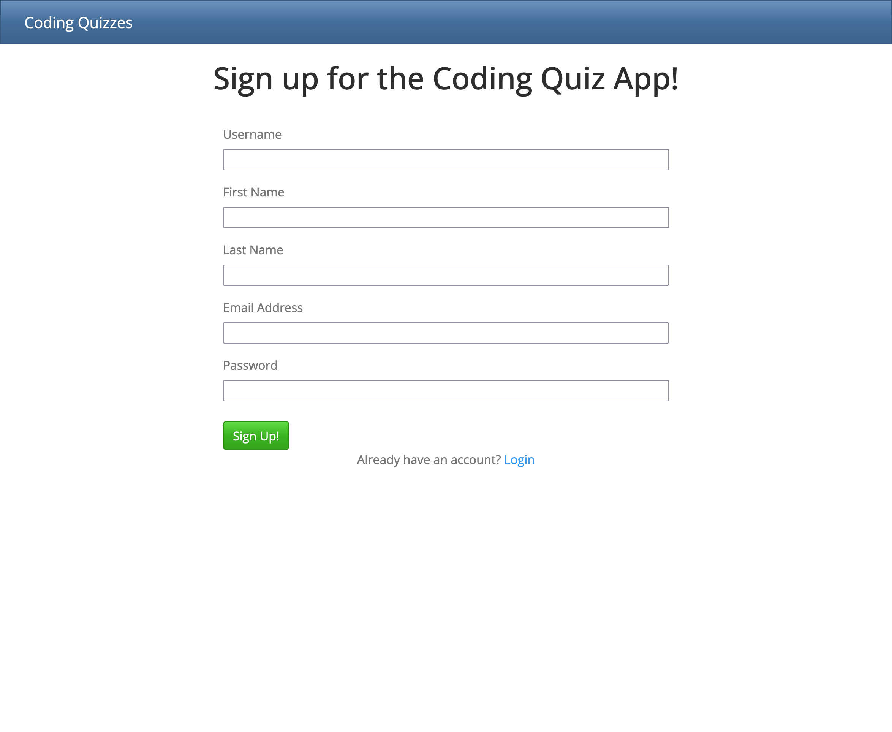
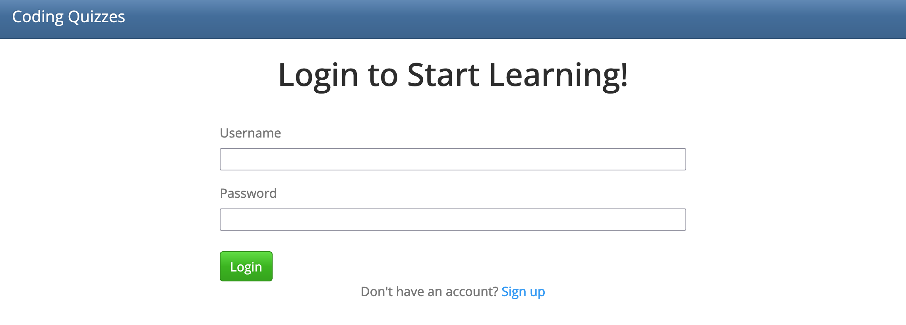
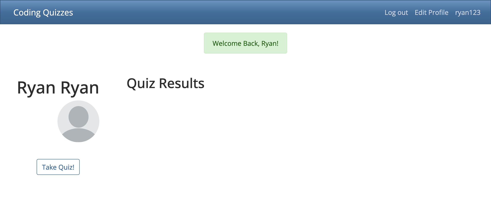
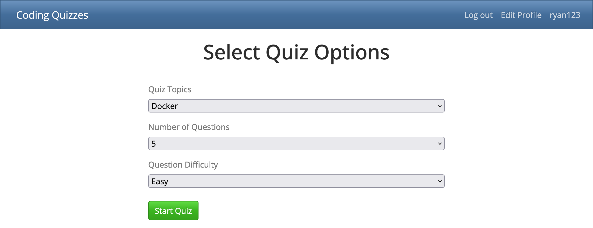
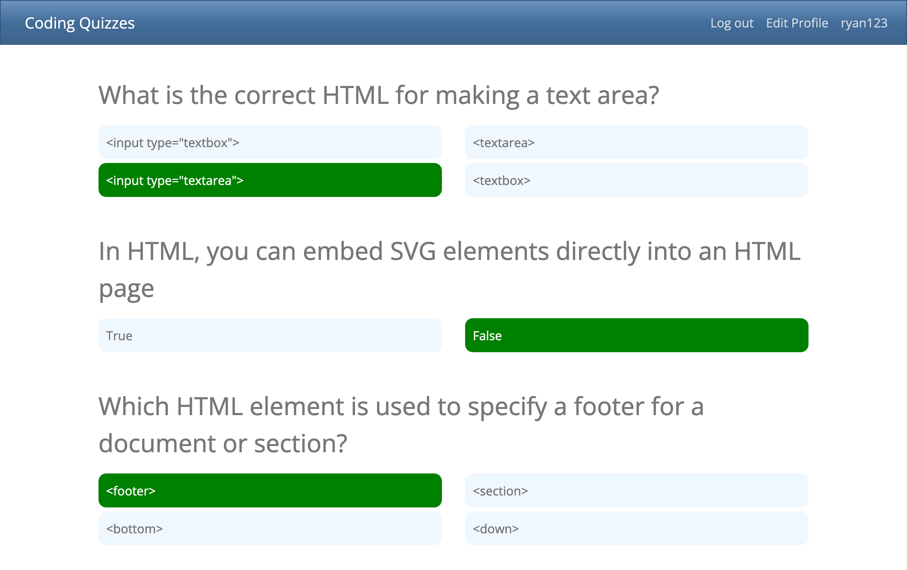
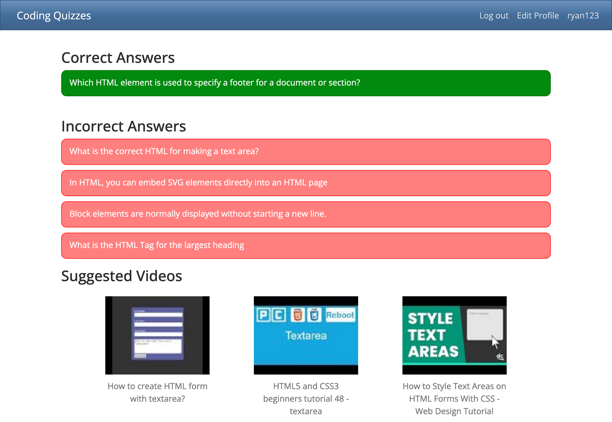

# Coding Quiz App

This app allows users to signup and take quizzes based on questions from the QuizAPI. After the user takes the quiz they can see their results and are given suggested videos based on the questions they missed or did not answer.

## Deployed Site:
View the deployed app [here](https://coding-quiz-app-rb.herokuapp.com/signup).

## APIs Used
- [Quiz API Documentation](https://quizapi.io/docs/1.0/overview)
  - Quiz API Base URL: https://quizapi.io/api/v1/questions 
- [YouTube API](https://developers.google.com/youtube/v3/docs/)
  - YouTube API Base URL: https://youtube.googleapis.com/youtube/v3/search

## Technology Stack
- Python
- JavaScript
- CSS/HTML
- PostgreSQL
- Flask
- JQuery
- Bootstrap
- Axios

## User Flow

- When the user first goes to the home page they will see the signup page.

- If the user already has an account they can click the link at the bottom of the page to go to the login screen

- Once the user is logged in they will be taken to their user dashboard.

- Here the user can click the Take Quiz button to go to the page to create their quiz.

- Once they have selected the category, number of questions and difficulty they will click start quiz and be taken to the quiz.

- Once they have submitted the quiz they will be taken to the results page.

- The user can also edit their information by clicking the Edit Profile in the top right corner.
